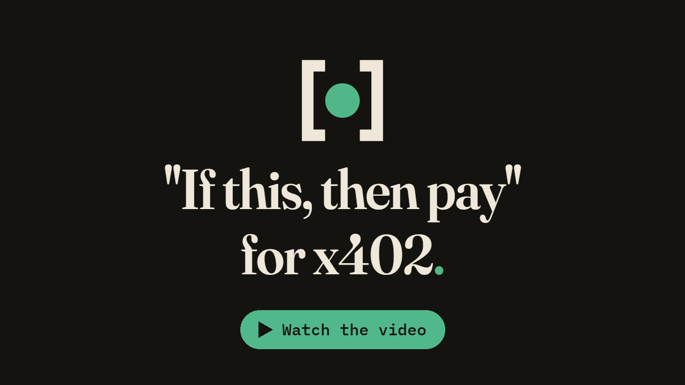
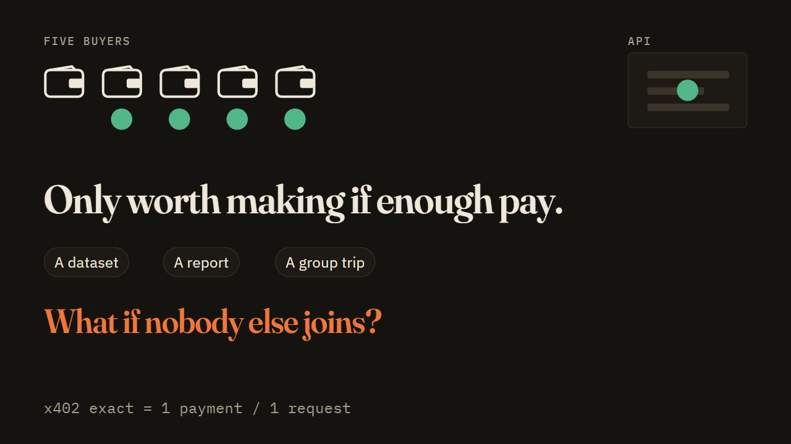
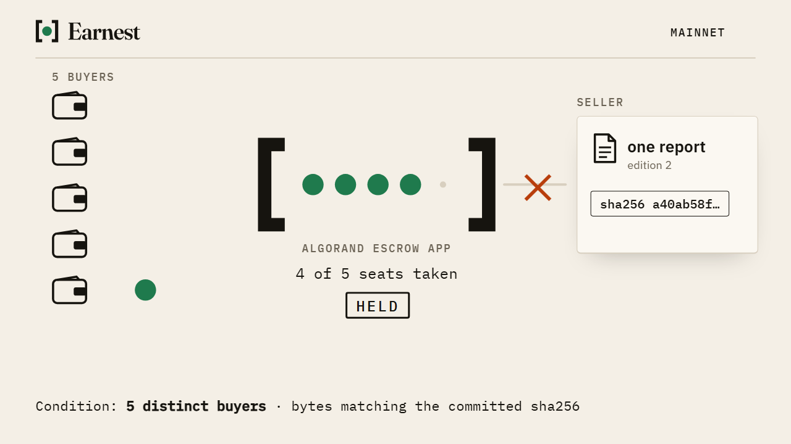
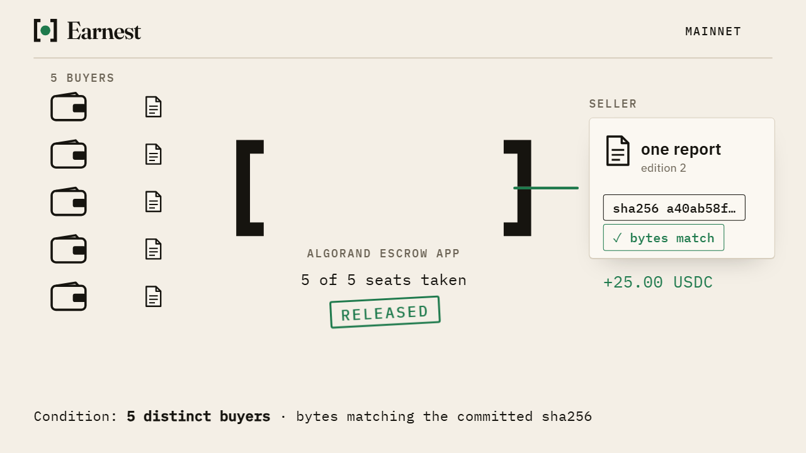
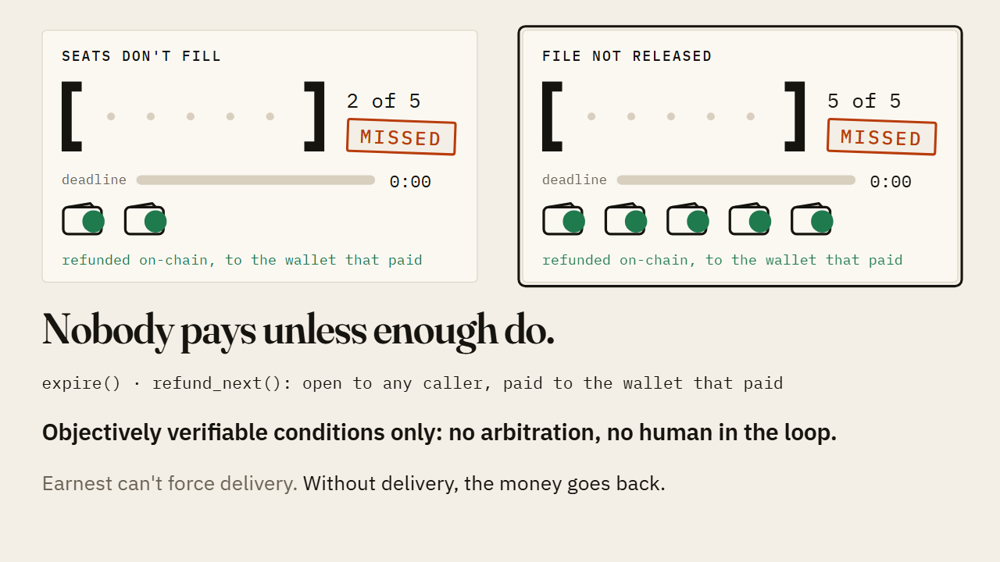
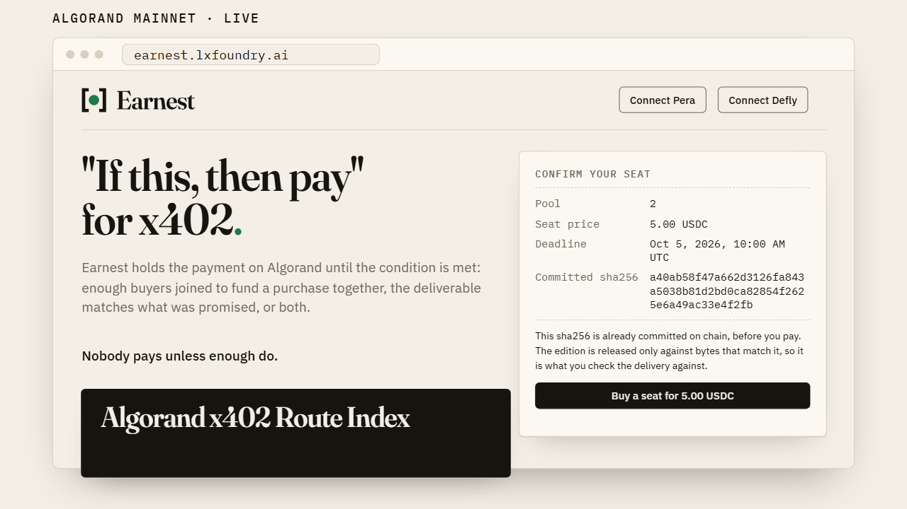
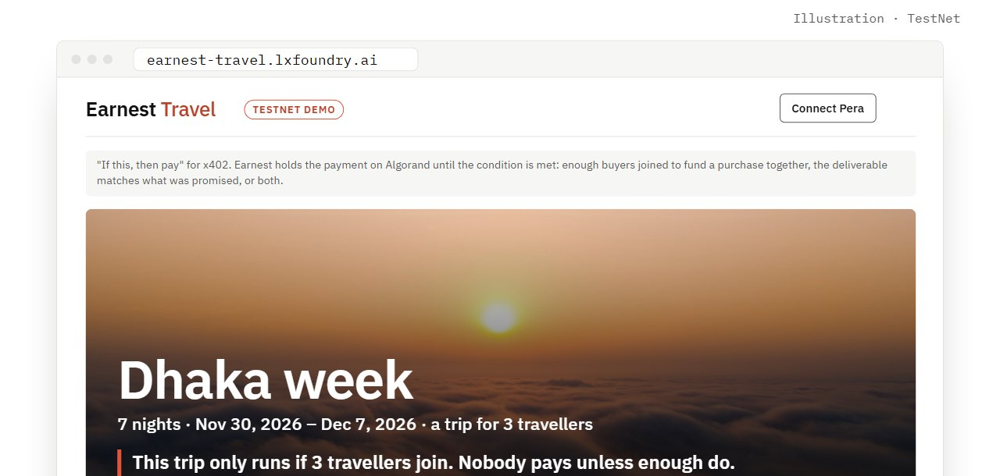
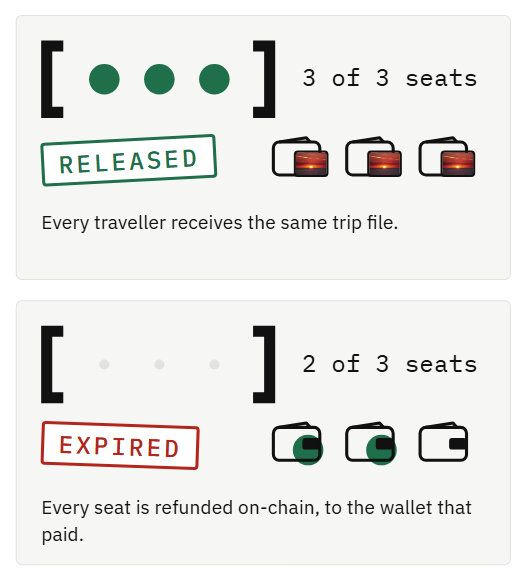
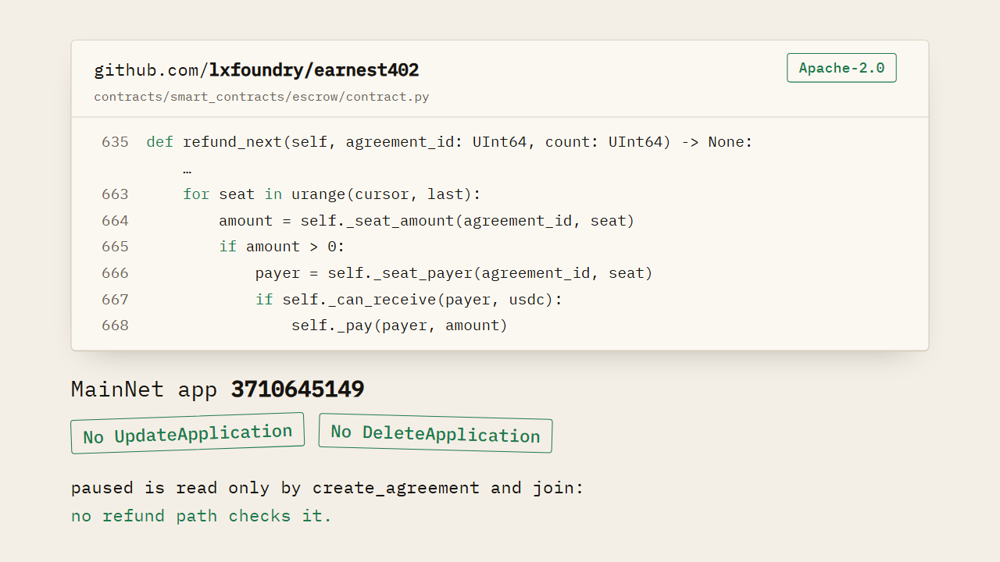
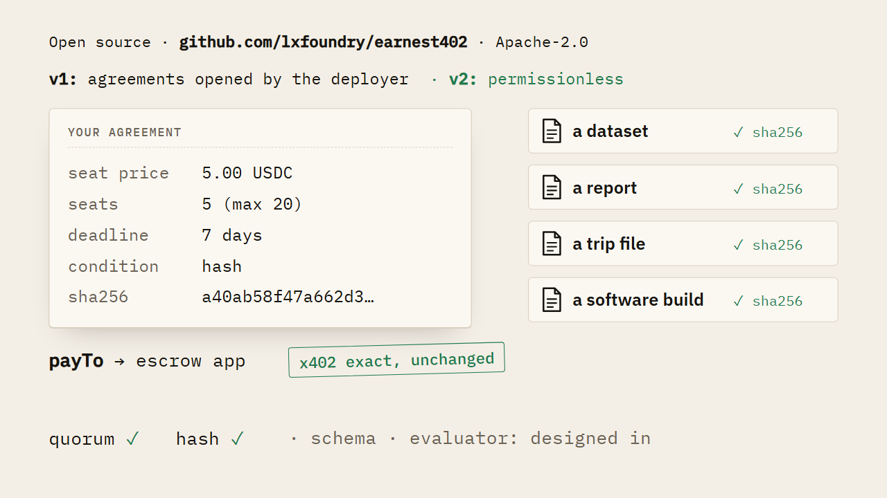

# Earnest

**"If this, then pay" for x402.** Earnest holds the payment on Algorand until the condition is met:
enough buyers joined to fund a purchase together, the deliverable matches what was promised, or both.

**Nobody pays unless enough do.** It runs live in two places: on Algorand MainNet, where 5 distinct
buyers fund an edition of the Algorand x402 Route Index with real USDC, and on TestNet, where 3
travellers take seats on a sample group trip with free test USDC.

In both, what was promised is a file whose sha256 was written on chain when the seats opened, before
anyone could pay. The money waits in an escrow app, not with the seller. If the seats don't fill, or
the file isn't released by the deadline, every seat is refunded on-chain to the wallet that paid.

**Objectively verifiable conditions only: no arbitration, no human in the loop.**

[](https://youtu.be/sikRaBG14Hk)

| | |
|---|---|
| **Buy a seat on MainNet**, real USDC | <https://earnest.lxfoundry.ai/app/> |
| **Try the travel demo on TestNet**, free | <https://earnest-travel.lxfoundry.ai/app/> |
| **Read the free report**, edition 2 | <https://earnest.lxfoundry.ai/app/editions/edition-2-sample.html> |
| **Check the contract yourself** | [Verify what is actually running](#verify-what-is-actually-running) |

## What Earnest is

x402 turns an HTTP request into a payment. An agent asks an API for a resource, the server answers
`402 Payment Required`, the agent signs a USDC payment, and the resource comes straight back. One
buyer, one request, one payment: for machine-to-machine micropayments, it's exactly right.

But some things are only worth making if enough buyers pay for them. A dataset. A report. A group
trip. Pay first, and you carry the risk alone. And x402 settles one payment per request: nothing in
it says *only if enough of us pay*.



Underneath is an Algorand escrow app holding a standard `exact` USDC payment against a deadline and
a release condition. Each buyer's x402 payment goes to the escrow app's account, not to the seller.
The contract counts the seats. When the last one is taken and the seller releases bytes that match
the committed sha256, the money goes to the seller, and every buyer gets the file.

<p>


</p>

If the seats don't fill by the deadline, or the file isn't released in time, every seat is refunded
on-chain, to the wallet that paid. Anyone can trigger it, any buyer included.



Earnest can't force delivery. It makes sure that without delivery, the money goes back
([the limit, stated plainly](#the-limit-stated-plainly)).

## Try it live

### 1. On MainNet, with real money: the Algorand x402 Route Index



Earnest's first product is the **Algorand x402 Route Index**: every x402 route the facilitator's
directory lists for USDC on Algorand, probed live. Each edition is produced and hashed before its
seats open.

**Edition 2 is for sale now.** On 28 Sep we called, unpaid, all 2,103 endpoints the directory lists:

- 1,536 asked for payment, 462 answered without a 402, 105 were unreachable
- of 1,097 with both a listed and a live price, 223 differ, 53 by 10× or more

Free report, aggregates only:
**<https://earnest.lxfoundry.ai/app/editions/edition-2-sample.html>**

A seat buys the full edition, naming every endpoint and its payee, in 3 formats: HTML to read, CSV
to analyse, JSON for agents. The sha256 committed on chain is the JSON's:

```
a40ab58f47a662d3126fa843a5038b81d2bd0ca82854f2625e6a49ac33e4f2fb
```

- **5 seats, 5 USDC each.** Condition: 5 distinct buyers must join before **Mon 5 Oct 2026, 10:00
  UTC**, one seat per wallet
- If the seats don't fill, or we don't release by then, the edition is not published and every
  seat is refunded on-chain to the wallet that paid
- Your payment settles into the escrow app, not our wallet. It reaches us only through a release
  that presents that sha256, and that transaction carries the IPFS link, so you can hash what you
  get
- We run the refunds; anyone can send them from the pool page

**Buy a seat: <https://earnest.lxfoundry.ai/app/>**

You need an Algorand wallet with 5 USDC (tested with Pera); the facilitator currently pays the
network fee.

Edition 1 ran the same way, with real money. Two buyers joined, the seats didn't fill, the edition
was not published, and the contract refunded both on-chain.

### 2. On TestNet, for free: Earnest Travel



Earnest Travel runs the same program as a second application on Algorand TestNet, set up as a group
trip. It's a demo paid with test USDC, so trying it costs nothing.

- A sample group trip for **3 travellers**, **5 test USDC** a seat, on a 3-day deadline
- The trip file's sha256 is committed on chain before anyone pays
- If 3 different travellers take a seat before the deadline, every traveller receives the trip
  file, released only against bytes that match it
- If the trip doesn't fill, or the trip file isn't released by the deadline, every seat is refunded
  on-chain to the wallet that paid. Once the deadline has passed, anyone can send the expire call
  from the page
- One seat per wallet

<p align="center">

</p>

**Try it, it's free: <https://earnest-travel.lxfoundry.ai/app/>**

Free test funds, in four steps:

1. Pera (tested; Defly untested): Settings › Developer settings › Node settings › TestNet, then
   connect. If you switched after connecting, disconnect and reconnect.
2. Get TestNet ALGO at <https://lora.algokit.io/testnet/fund> (sign-in and captcha); keep at least
   0.3 ALGO.
3. Add asset `10458941` (USDC).
4. <https://faucet.circle.com> → Algorand Testnet: 20 USDC every 2 h; a seat costs 5.

> **Demo notice.** A technical demonstration on Algorand TestNet, paid with test USDC. Nothing is
> booked or sold, no travel takes place, and the trip file cannot be exchanged for travel or
> anything else. The seat price is not a share of the fare. A real group trip would be sold by a
> licensed organiser as merchant of record. Fare data: Sabre Flight Search API, CERT test
> environment. Indicative, not bookable. Earnest Travel is an independent demo, not a Sabre product.

---

It's new, so if anything breaks or reads wrong, say so: [open an
issue](https://github.com/lxfoundry/earnest402/issues).

## How it works

The rest of this page is the machinery, and the code that runs it.

### The two release conditions

| Condition | Releases when | Refunds when |
|---|---|---|
| `quorum` | `min_seats` distinct payers have joined | the deadline passes with fewer |
| `hash` | the delivered bytes' sha256 equals a commitment fixed at creation, before anyone pays | the deadline passes without a match |

*"What was promised"* is never a judgment about quality. It is a 32-byte sha256 written into the
agreement when the agreement is created, and unchangeable afterwards — so a supplier has to commit
to the exact bytes before taking a payment, and the chain only ever compares two numbers.

A `hash` agreement can also take more than one seat. It then releases only once every seat is
filled and the deliverable matches, and every payer is refunded if either falls short by the
deadline. That is the "or both" case, and it is still `hash`, not a third condition. Both live apps
above use it.

Two further condition types, `schema` and `evaluator`, are *designed in* — the record carries a
condition field and the state machine has room for them — but neither is shipped. Two conditions
exist today.

### What is in this repository

| Path | What |
|---|---|
| `contracts/` | The escrow application: Algorand Python source, compiled TEAL and ARC-56 artifacts, and its 140-test suite |
| `docs/specs/escrow-contract.md` | The specification it was built from — states, storage layout, ABI, authorisation, invariants, failure modes |

Not published yet: the resource server that answers the x402 `402`, the web client, and the
operator tooling. This repository is the part that holds the money, which is the part worth
checking.

### Verify what is actually running

| Network | Application | Application account | Serves |
|---|---|---|---|
| MainNet | [`3710645149`](https://lora.algokit.io/mainnet/application/3710645149) | `2IZVDH36QFPIQFKOBKHAN4CREL4K77PXU6HQ5RMOF5E47DPE5XZ37Q772I` | the Route Index, [earnest.lxfoundry.ai](https://earnest.lxfoundry.ai/app/) |
| TestNet | [`772795100`](https://lora.algokit.io/testnet/application/772795100) | `ZUGHACLDTHEDD5QYKCCQLKFN3TUUS27VTOV22R37FKWCRDRSVMWPPBUJIY` | Earnest Travel, [earnest-travel.lxfoundry.ai](https://earnest-travel.lxfoundry.ai/app/) |
| TestNet | [`771795120`](https://lora.algokit.io/testnet/application/771795120) | `CVD7RDNAMB6KPAOS26UEGWOT4MVGFJXRDEIUMOEBPA57FZ7PVVXCKCU5OI` | TestNet rehearsals of the Route Index |

All three run the same program, byte for byte, and all three match the artifacts committed here.

**1. Hash the deployed program:**

```bash
curl -s https://mainnet-api.4160.nodely.dev/v2/applications/3710645149 \
  | python -c "import sys,json,base64,hashlib; p=json.load(sys.stdin)['params']; \
print(hashlib.sha256(base64.b64decode(p['approval-program'])).hexdigest())"
```

For a TestNet application, use `https://testnet-api.4160.nodely.dev` and its application id.

**2. Hash the artifact in this repository:**

```bash
python -c "import json,base64,hashlib; \
b=json.load(open('contracts/smart_contracts/artifacts/escrow/Escrow.arc56.json'))['byteCode']['approval']; \
print(hashlib.sha256(base64.b64decode(b)).hexdigest())"
```

Both print the same digest:

```
9413f24811ab11b4ed0006da32f4f10741996e11f9019415c45e300087a0b647
```

Substituting `clear-state-program` and `['clear']` in the two commands confirms the clear-state
program the same way: `ed90f0d2da1f1d1abd773c45230651a292a90edbc12a7bf859a493a12a640ce7`.

**3. Rebuild from source and check the artifact is not just asserted.** Needs
[AlgoKit](https://github.com/algorandfoundation/algokit-cli) and Python 3.12; the compiler is
`puya` 5.10.0, pinned by `contracts/poetry.lock`.

```bash
cd contracts
algokit project bootstrap all
algokit project run build
```

### What the contract can and cannot do to you



Every claim below is checkable against the source in this repository and against the ABI in
`contracts/smart_contracts/artifacts/escrow/Escrow.arc56.json`.

**The program can never be changed or deleted.** `Escrow.arc56.json` declares
`bareActions: {"create": [], "call": []}`, and every one of the twelve methods is `NoOp`-only. There
is no `UpdateApplication` and no `DeleteApplication` path in the ABI, so the bytes you verified
above are the bytes that will run for the life of the application.

**Pausing cannot trap your money.** The contract has an admin, and the admin can set a `paused`
flag. That flag is read in exactly two places — `create_agreement` and `join`
(`contract.py:252` and `contract.py:392`). It does not appear in `expire`, `refund_next`,
`claim_refund`, `release_quorum`, `release_hash` or `close`. A paused contract stops taking new
money; it cannot stop money leaving.

**Refunds do not need us.** Past the deadline, `expire` is permissionless, and so are `refund_next`
and `claim_refund`. Anyone can push a stalled agreement into refund and walk the roster; a payer the
batch had to skip can pull their own seat back with `claim_refund`. If the operator disappears, the
refund path still works, and the admin has no method that interferes with it
(`tests/test_escrow_expire_refund.py`, 47 cases).

**`release_quorum` is permissionless**, because the contract counted the payments itself. Once
`min_seats` is reached the condition is permanently true — there is no leave and no withdraw — so
anyone may trigger the release (`tests/test_escrow_release.py::test_release_quorum_is_permissionless`).

**A late release cannot race a refund.** `release_hash` asserts
`Global.latest_timestamp < deadline`, so once the deadline passes the only reachable path is refund.

#### The limit, stated plainly

`release_hash` requires the `verifier` named in the agreement, and for agreements we create, that
verifier is us. The contract checks that the submitted sha256 equals the committed one; it cannot
check whether we bothered to submit anything at all.

So for a `hash` agreement the chain guarantees **a refund if the deliverable does not arrive** — not
delivery itself. The deadline is what enforces it: if we never release, the money goes back, and
nothing in the contract lets us stop that. `quorum` has no equivalent gap, because
`release_quorum` needs no one's cooperation.

This is the residual trust in the design, and naming it is part of the design.

### Use it for your own route



To keep v1 simple, only the contract's admin, its deployer, can open agreements. So you deploy your
own copy of this contract, open an agreement with a price, a seat count (up to 20), a deadline and
a sha256, and point your x402 route's `payTo` at the application account.

Standard `exact` scheme, no protocol change. Each buyer's payment group carries the ordinary USDC
transfer and a `join` call naming the agreement, and the facilitator settles it like any other
`exact` payment. `docs/specs/escrow-contract.md` has the ABI and the group layout. `quorum` and
`hash` ship today; `schema` and `evaluator` are designed in. A permissionless version will follow
in v2.

### Build and test

```bash
cd contracts
algokit project bootstrap all     # Poetry venv + dependencies
algokit localnet start            # Docker
poetry run pytest                 # the escrow test suite
algokit project run build         # recompile TEAL and ARC-56 artifacts
```

`contracts/README.md` has the longer AlgoKit walkthrough. `join_spike` alongside the escrow is a
deliberate stub — it exists only to prove that a payment group carrying an extra buyer-signed
application call is accepted, and has none of the roster, release or refund logic.

## Licence

[Apache-2.0](LICENSE).
