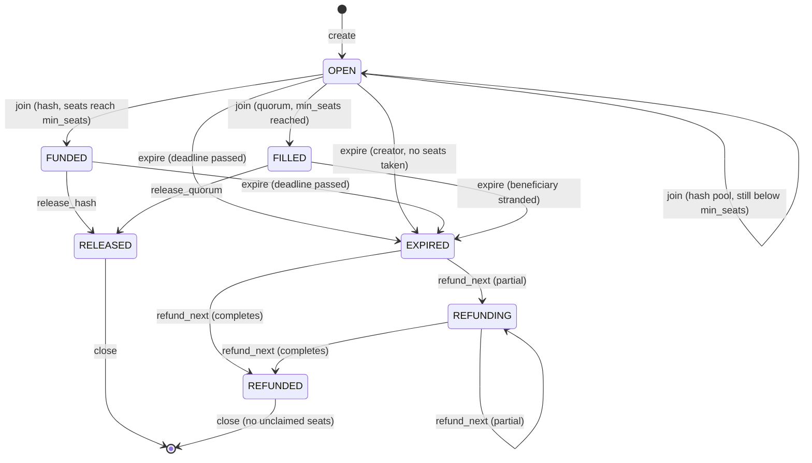

# Escrow contract — states, storage, ABI and invariants

The on-chain half of Earnest: one Algorand application that holds an x402 `exact` USDC payment
against a deadline and a machine-checkable release condition, then releases or refunds it on-chain
according to that condition.

This is the specification the implementation is built from. It describes what the contract is and
how it behaves; it does not describe the resource server, the off-chain indexer, or the
worker-commissioning protocol. §11 states what the contract *assumes* the backend does, as an
interface only.

**Toolchain:** Algorand Python (`algopy`) under AlgoKit.

---

## 1. The core abstraction: one agreement

**One application, one record type.** Every escrow — delivery or pooled — is an *agreement*: an id,
a release condition, a deadline, a beneficiary, and a roster of payers.

- **Single-payer delivery escrow** is an agreement with `max_seats = 1` and condition `hash`.
- **A pool** is the same record with `min_seats > 1`. Its condition may be either:
  `quorum` releases permissionlessly once the seats are filled, and `hash` releases against
  delivered bytes matching a `sha256` committed at creation. A `hash` pool is therefore the mode
  that holds N buyers' money until a specific deliverable arrives, and refunds all of them on chain
  if it does not.

One state machine, one storage layout, one refund path. Multi-payer is not a variant — it is the
only shape, and `N = 1` is a degenerate case of it.

**One application, therefore one `payTo` address.** Splitting the two shapes across two
applications would create two receiving addresses; discovery, merchant identity and settlement
attribution all key on a stable receiving address, so the design keeps exactly one.

### Release conditions

| Condition | Value | Releases when | Has leg 2 |
|---|---|---|---|
| `hash` | 0 | the delivered bytes' sha256 matches the commitment recorded at creation | yes (single-seat delivery escrow only) |
| `quorum` | 1 | `min_seats` distinct payers have joined before the deadline | no |

**Leg 2 belongs to the single-payer delivery flow, not to the condition.** It is the backend
paying a worker's own x402 endpoint to produce the bytes, and it exists only for the single-seat
`hash` escrow (`docs/specs/delivery-escrow-backend.md`). A multi-seat `hash` pool commits to a
deliverable that is already specified, and the contract is indifferent either way: it compares two
32-byte values and never learns who produced them.

`schema` and `evaluator` are **designed for, not built**. `condition` is a `uint8` discriminator, so
adding one is a new branch and a new field rather than a storage migration. Never describe them as
supported.

---

## 2. State machine



`FILLED` and `FUNDED` both mean "the seats are full". They are distinct states because the release
path differs: `FILLED` releases permissionlessly on seat count, `FUNDED` releases only against
delivered bytes and only by the verifier.

State is stored as a `uint8`: `OPEN` 0, `FUNDED` 1, `FILLED` 2, `RELEASED` 3, `EXPIRED` 4,
`REFUNDING` 5, `REFUNDED` 6. `CLOSED` is **not** a stored state — `close` deletes the boxes. The
permanent record is the event log (§8), not the box.

### 2.1 Transition table

| From | Method | Guard | To |
|---|---|---|---|
| — | `create_agreement` | admin · validity table (§5.1) · beneficiary can receive USDC · exact deposit attached (§3.4) | `OPEN` |
| `OPEN` | `join` | `now < deadline` · `seats < max_seats` · payer not already on the roster · transfer amount equals `share_price` exactly | `OPEN`, or `FUNDED` / `FILLED` when `seats` reaches `min_seats` |
| `FUNDED` | `release_hash` | the agreement's own `verifier` · `now < deadline` · `sha256(bytes) == commit_hash` | `RELEASED` |
| `FILLED` | `release_quorum` | permissionless · no deadline check | `RELEASED` |
| `OPEN` / `FUNDED` | `expire` | permissionless · `now >= deadline` | `EXPIRED` |
| `OPEN`, `seats == 0` | `expire` | **creator only** · no deadline requirement (§2.3) | `EXPIRED` |
| `FILLED` | `expire` | permissionless · `now >= deadline` **and** beneficiary cannot receive USDC (§2.2) | `EXPIRED` |
| `EXPIRED` / `REFUNDING` | `refund_next(n)` | permissionless · pays or skips the next ≤ `n` roster entries in seat order (§5.4) | `REFUNDING`, or `REFUNDED` when the cursor reaches `seats` |
| `EXPIRED` / `REFUNDING` / `REFUNDED` | `claim_refund(seat)` | permissionless · `seat < refund_cursor` (the pass reached it and skipped it) · still unpaid | state unchanged; `unclaimed_seats` decremented |
| `RELEASED` / `REFUNDED` | `close` | permissionless · `unclaimed_seats == 0` · `total_held == 0` | record deleted, ALGO returned to `creator` |

### 2.2 Four properties this buys

**`FILLED` does not expire on the clock.** Once `min_seats` is reached the condition is permanently
met — there is no leave and no withdraw — so a deadline alone never sends a filled agreement to
`EXPIRED`. Without this, `release_quorum` and `expire` would both be callable on the same record and
the outcome would depend on transaction ordering.

**The stranded-beneficiary rescue.** `beneficiary` on a pooled agreement is a third party who could
stop being able to receive USDC after the pool fills. `release_quorum` would then fail forever and,
because `FILLED` has no other exit, the pot would be permanently locked. So `expire` gets one extra
legal transition, from `FILLED`, guarded on `now >= deadline` **and** the beneficiary being unable to
receive.

**"Cannot receive" is two conditions, not one.** The beneficiary may have opted out of the asset, or
may be opted in with a *frozen* holding — USDC declares a freeze address, so both are reachable. The
guard tests the same predicate the release path depends on: opted in **and** not frozen. Testing
opt-in alone would leave a frozen beneficiary in `FILLED` with neither exit available —
`release_quorum` failing on the inner transfer and `expire` refusing because the beneficiary is still
opted in — which is the exact lockup this transition exists to prevent.

Because both sides read one predicate, the guard is mutually exclusive with `release_quorum`
succeeding: at any moment exactly one of the two can pass, and the no-ordering-dependence property
survives. Creation already asserts the beneficiary can receive, so reaching this path takes a
deliberate act, not an oversight.

**Release on fill, not at the deadline.** The fact cannot un-become true, so releasing as soon as
the quota is met is strictly better than waiting out a timer. Joining closes at whichever comes
first: release or deadline. A pool's seat count is fixed at the quota (§4), so those are the only
two — reaching the last seat *is* the release becoming available. Note what this means: reaching `FILLED` makes the release
available to anyone, permanently and irreversibly, in favour of a third party. There is no window in
which the operator could review, hold or reverse it — which is the point, and why the supplier's
address must be settled before `create` rather than before release.

**No late-release race.** `release_hash` is guarded on `now < deadline`, so a delivery arriving after
the deadline cannot beat a refund. Whichever of `expire` and `release_hash` lands first wins on the
state guard and the other fails cleanly.

**One clock, two windows — and a pool spends the first one filling.** The same `deadline` bounds
both how long the seats have to fill and how long the deliverable has to arrive. A single-seat
escrow fills in one settlement, so the distinction barely costs anything; a 20-seat pool fills in
twenty, each one a real settlement group at whatever rate buyers actually arrive. A pool that fills
close to its deadline therefore leaves almost no room for `release_hash`, and the money returns to
the payers even though the bytes existed. Whoever creates a multi-seat agreement dates the deadline
for filling **plus** delivering, never for delivering alone. The contract cannot help here: it
holds one timestamp, and splitting it would be a second field and a second guard on every path.

### 2.3 The creator reclaims an agreement nobody paid into

An agreement must exist, holding its minimum balance, **before** the buyer can pay into it: `join`
names an `agreement_id`, so the record is created at the moment a price is quoted rather than at the
moment money arrives. Every quote that is never taken up therefore parks a deposit.

That deposit is the working capital the *next* agreement needs, so on a busy or hostile endpoint the
binding constraint is not loss but **capacity to quote at all**. Waiting out the deadline is the
wrong instrument, because one deadline serves two different purposes: how long a buyer has to pay,
and how long the deliverable has to arrive. Sized for delivery, it is far longer than a funding
window needs to be.

So `expire` carries one exception to the clock:

> **`seats == 0` and `Txn.sender == creator` ⇒ no deadline requirement.**

`seats == 0` is exactly the condition "nobody has paid into this", so there is no payer whose refund
could be brought forward, no balance to move, and no party affected but the creator taking back their
own deposit. The funding window becomes operator policy (§11.9a) — adjustable, and shrinkable under
load — instead of a second timestamp on every record.

**Why creator-only.** A permissionless early exit would let a stranger cancel a live quote out from
under a buyer who is already assembling a settlement group. Nothing is stolen — the group is atomic,
so their payment simply never lands — but it is a free denial of service against buyers, which is a
worse problem than the one the exception solves. Past the deadline `expire` stays permissionless, and
that must not change: it is what keeps refunds reachable if the operator disappears (§9).

**Why this is not a way to strand a payer.** The moment a single seat is taken the exception stops
applying and the clock is back in charge, so an agreement holding money can only ever expire the way
it always could.

---

## 3. Storage

### 3.1 Global state

`admin` · `treasury` · `usdc_asset_id` · `agreement_count` · `paused`. Five values.

`treasury` is a **configuration record only**: the backend reads it as the conventional
`beneficiary` for `hash` agreements, and it labels rows in reporting. **No fund-moving path in the
contract reads it** — every release pays the `beneficiary` written into the agreement box.

`verifier` is deliberately **not** global. It lives in the agreement record, immutable from creation
(§5.2).

### 3.2 Boxes

**`a{id}`** — the agreement record, **164 bytes**:

| Field | Type | Bytes |
|---|---|---|
| `condition` (0 = `hash`, 1 = `quorum`) | uint8 | 1 |
| `state` | uint8 | 1 |
| `deadline` (unix seconds) | uint64 | 8 |
| `share_price` (USDC micro-units) | uint64 | 8 |
| `min_seats` · `max_seats` · `seats` · `refund_cursor` · `unclaimed_seats` | uint16 × 5 | 10 |
| `total_held` | uint64 | 8 |
| `commit_hash` (zero for `quorum`) | byte[32] | 32 |
| `beneficiary` | address | 32 |
| `verifier` (zero for `quorum`) | address | 32 |
| `creator` (receives reclaimed ALGO) | address | 32 |

**`r{id}`** — the roster: a packed array of `(payer, amount)` at **40 bytes per seat**, pre-sized to
`max_seats` at creation and read by slice extraction.

### 3.3 Why a roster box rather than a box per (agreement, payer)

**Boxes cannot be enumerated from inside a contract.** A refund must walk the payers, so a per-payer
layout needs a parallel index box anyway. The roster *is* that index, with the amount inlined.

**It deletes a failure mode instead of mitigating it.** With one pre-sized roster, all box storage
exists before the first join and its minimum balance is paid at creation, so **a join can never fail
for want of minimum balance**. "Payment lands but the record fails to create" is structurally absent
rather than merely unlikely.

The cost is a linear scan of the roster for the duplicate-payer check, and it is what sets the seat
ceiling. `join` runs in the AVM's 700-opcode per-call budget; the scan grows with the seats already
taken, so the last seat of a pool is the expensive one. **Measured on LocalNet, the budget runs out
partway through the 27th join** — the group scan of §6 shares the same budget and costs about two
seats of it. The published ceiling (§10) is set below that wall with headroom, and one test per
pooled condition fills a pool to exactly the ceiling so the number cannot silently stop being
true.

Budget pooling — a no-op application call in the same group buys another 700 — would raise the
ceiling, but it makes the settlement group four transactions, and only the two three-transaction
orderings in §6 are confirmed accepted by the facilitator. Making the scan itself cheaper (a payer
set in a second box, joins O(1)) costs another box, more minimum balance and another reference in
every `join`; it is the way past the wall when the ceiling starts to bind.

### 3.4 Minimum-balance arithmetic

Box minimum balance is `2,500 + 400 × (key bytes + value bytes)` µALGO.

| Component | Single-payer (`max_seats = 1`) | 20-seat pool (the ceiling) |
|---|---|---|
| Agreement box (9 + 164 bytes) | 0.0717 ALGO | 0.0717 ALGO |
| Roster box (9 + 40 × seats) | 0.0221 ALGO | 0.3261 ALGO |
| **Total, reclaimed at `close`** | **0.0938 ALGO** | **0.3978 ALGO** |

```
roster MBR  = 2,500 + 400 × (9 + 40 × max_seats) µALGO
            = 0.0061 ALGO  +  0.016 ALGO per seat
total stake = 0.0788 ALGO  +  0.017 ALGO per seat     (agreement box + roster + fee reserve)
```

Plus, permanently at the application level: 0.1 ALGO base and 0.1 ALGO for the USDC opt-in.

**Fee reserve — fatal if forgotten.** Refunds and releases are inner transactions whose fees are paid
by the *application account*, not the caller. `create` must attach `(max_seats + 1) × min_txn_fee` on
top of the box minimum balance: 0.021 ALGO for a 20-seat pool at today's 0.001 ALGO minimum. The
unspent remainder returns to `creator` at `close`.

The reserve is priced at the **live protocol minimum fee**, read on the call, not at a compiled-in
constant — the same value the inner transfers themselves charge. Pricing the two separately would let
them drift if the protocol parameter ever moved, and the drift that matters is upward: an
under-funded reserve makes `close` return more than the agreement has left, which draws on another
agreement's deposit and breaks ALGO conservation (§7).

**The deposit is exact, not a floor.** `create` rejects an overpayment as firmly as a shortfall. The
amount is deterministic from `max_seats`, and `close` returns a *computed* figure — box minimum
balance plus the unspent reserve — never whatever happened to arrive. Anything above the required
deposit would therefore have no way back out: no method sweeps the application account, and the
application has no delete handler. Rejecting an overpayment costs the caller a retry; accepting one
locks the excess for good.

The reserve covers the paged-and-skipped refund path: release and refund are mutually exclusive and
each seat is paid at most once, so the ceiling on inner transactions per agreement stays
`max_seats + 1`. A failed `refund_next` costs the reserve nothing — the group aborts before any inner
transaction is submitted — and a skipped seat consumes no inner transaction at all.

**Callers pay only their own transaction fee.** Because inner-transaction fees come from the
pre-funded reserve, a stranger paging refunds for an agreement they have no stake in spends roughly
0.001 ALGO. That is what makes the permissionless refund path economically real rather than
nominally open.

---

## 4. Pool seat count is fixed

**`max_seats` equals `min_seats`.** Every agreement is created with exactly as many seats as its
quota, whatever its condition, and `create_agreement` rejects anything else. The roster is
pre-sized to that count at creation, so a join can never fail for want of minimum balance.

**Why a pool cannot be over-subscribed.** A pool buys a fixed deliverable at a fixed price: the
supplier is owed `share_price × min_seats` (§11.11) and delivers one outcome. A seat past the quota
would pay full price into an outcome that does not grow, so a buyer's `share_price` would purchase
`1/seats` of something they priced at `1/min_seats` — a worse deal imposed on them by how many
others happened to arrive afterwards. A release condition has to be legible before the buyer signs,
and a denominator that can still move is not.

**Slack was unreachable in any case.** An agreement leaves `OPEN` the moment `seats` reaches
`min_seats`, and `join` accepts only `OPEN`, so no payer could ever occupy a seat above the quota.
`max_seats` above `min_seats` bought nothing and cost 0.016 ALGO of roster minimum balance per
permanently unusable seat. The `seats < max_seats` assertion in `join` remains as a bound behind the
state guard; it is never the thing that rejects a payer.

**Overflow demand goes to another agreement, not a wider one.** A pool that fills while buyers are
still arriving is the signal to create a second pool: two pools of N settle 2N payments and deliver
two outcomes, where one pool of 2N settles 2N payments and delivers one. Routing overflow is a
backend obligation (§11.13). A late `join` fails on the state guard, and because the settlement group
is atomic the buyer's transfer never settles — nothing is lost but the request.

**The stake is working capital, not spend.** Every µALGO returns to `creator` at `close`, so the real
cost is capital tied up across *concurrently live* agreements. Twenty concurrent 20-seat pools stake
about 8.4 ALGO in total.

**What a variable seat count would require.** Paying the surplus to the supplier is the cheap version
and is rejected above: it also rewards understating `min_seats`, which would turn the quota from a
cost basis into a number worth gaming. The defensible version refunds the surplus pro rata, and that
turns release from one inner transfer into one per payer — dragging the whole paged-refund apparatus
onto the release path, cursor and skip and claim, plus a state where the supplier is paid and buyer
surplus is still outstanding. That is a separate release condition with its own branch on the
`condition` discriminator, not a flag on `quorum`.

---

## 5. ABI surface

### 5.1 Methods

| Method | Authorisation | Effect |
|---|---|---|
| `bootstrap(usdc_asset_id, treasury)` | creator, on create | application constructor; sets `admin` |
| `create_agreement(condition, share_price, min_seats, max_seats, deadline, commit_hash, beneficiary, verifier, mbr_payment) -> uint64` | admin | one constructor for both shapes |
| `join(agreement_id, payment_index)` | buyer, via the settlement group | §6 |
| `release_hash(agreement_id, delivered_bytes_hash)` | the agreement's `verifier` | inner USDC transfer to `beneficiary` |
| `release_quorum(agreement_id)` | **permissionless** | inner USDC transfer to `beneficiary` |
| `expire(agreement_id)` | **permissionless** after the deadline; **creator only** before it, and only while `seats == 0` (§2.3) | marks `EXPIRED` |
| `refund_next(agreement_id, count)` | **permissionless** | pays or skips up to `count` ≤ 4 seats in order (§5.4) |
| `claim_refund(agreement_id, seat)` | **permissionless** | pays one previously skipped seat |
| `close(agreement_id)` | **permissionless** | deletes boxes, returns ALGO to `creator` |
| `opt_in_asset(asset_id)` · `set_admin` · `set_paused` | admin | operations |

**One constructor, not two.** `create_job` and `create_pool` survive as typed helpers in the backend
client, off-chain. On-chain there is one `create_agreement`, because `condition` is a discriminator and
per-condition constructors would each need their own minimum-balance arithmetic, validation and
tests as conditions are added.

**Validity table, asserted on entry:**

| Argument | `condition = hash` | `condition = quorum` |
|---|---|---|
| `min_seats` · `max_seats` | `1 <= min_seats == max_seats <= 20` (§4) | `1 < min_seats == max_seats <= 20` (§4) |
| `commit_hash` | non-zero | must be zero |
| `verifier` | non-zero | must be zero — release is permissionless |
| `beneficiary` | non-zero · can receive USDC | non-zero · can receive USDC |
| `deadline` · `share_price` | `deadline > now` · `share_price > 0` | same |

**Seat count and condition are independent**, with two combinations excluded by construction:
`quorum` requires `min_seats > 1`, and `hash` requires a verifier, so a multi-seat agreement with a
committed hash and a permissionless release cannot be created. That leaves three modes: single-seat
`hash` (the delivery escrow), multi-seat `quorum` (a pool funding work not yet specified), and
multi-seat `hash` (a pool funding a deliverable already committed to).

`mbr_payment` is an ABI transaction argument and therefore carries the immediately-precedes
constraint: transaction arguments resolve positionally, as the transactions directly preceding the
app call. Harmless here, because `create_agreement` is admin-only and the caller builds the group.

### 5.2 The authorisation split

Everything whose triggering fact is **already in contract state** is permissionless: `release_quorum`
(the contract counted the payments itself), `expire` (the clock), `refund_next`, `claim_refund` and
`close`. Funds on those paths can only move to addresses already on the roster or to the
`beneficiary` fixed at creation, so an untrusted caller chooses *when*, never *where*. A buyer whose
pool misses its quota can recover their own money without the operator.

`release_hash` is the sole exception: only the party holding the delivered bytes can prove the match.

**Be honest about what the on-chain check is.** `release_hash` takes the *hash* of the delivered
bytes, not the bytes, so the contract compares two 32-byte values and a dishonest verifier could pass
`commit_hash` straight back. The comparison is a **record, not a proof** — the real verification
happens off-chain and its integrity rests on the verifier key. Documentation and copy must never
imply the chain is checking the deliverable.

**The verifier is per agreement and immutable.** A buyer inspecting `a{id}` sees their exposure fixed
at the moment they joined, rather than having to read global state and trust it will not move under
them. The cost is no key rotation for live agreements, accepted on three grounds: exposure is bounded
by the deadline; a compromised verifier cannot redirect funds, because `beneficiary` is immutable
too, so the worst outcome is an early release to the address already recorded; and a lost key fails
safe — no release, deadline passes, buyer refunds. `set_verifier` is not in the ABI.

### 5.3 Where the trustless guarantee stops

The ABI makes the contract look more self-sufficient than the system is. **The contract cannot pay a
worker's x402 endpoint itself; leg 2 is relayed by the backend.** Two independent blockers:

1. **x402 is an HTTP protocol.** Leg 2 is a `GET` carrying a payment header — someone must open the
   connection, read the 402, sign against its requirements, retry, and hold the response bytes. An
   AVM application has no HTTP client and nowhere to put a multi-megabyte deliverable. A bare inner
   transfer to the worker would not be an x402 payment at all: not facilitator-settled, and not
   associable with a request by the worker's endpoint.
2. **Ordering.** Release happens after hash verification, but the bytes being hashed are what the
   worker payment buys. Some party must front the money in between.

So the single-payer delivery composition is **not** trustless end-to-end: the counterparty risk on
leg 2 is not eliminated, it is relocated from the buyer onto the operator. The buyer walks away
whole in every branch; the escrow's buyer-protection purpose is preserved completely, and its
no-trusted-intermediary purpose stops at the operator's boundary.

**No pool carries any of it.** Leg 2 belongs to the delivery flow rather than to the condition (§1),
so neither a `quorum` pool nor a multi-seat `hash` pool has a worker, a leg 2 or float: with
`beneficiary` = the supplier the money goes buyer → escrow → supplier with nobody in between. What
a `hash` pool adds over a `quorum` one is that the money does not move until the committed bytes
are presented — the operator is the verifier, not a relay holding float.

### 5.4 Refund order, and why a dead wallet cannot freeze an agreement

**Order is FIFO by seat index, and the caller cannot choose.** The roster is appended to in join
order, so seat index *is* arrival order, and `refund_cursor` is a pointer into it.
`refund_next(id, count)` handles entries `[refund_cursor, min(refund_cursor + count, seats))` and
nothing else. The caller picks only *how many*, never *which*.

Per entry, in order:

1. Read `(payer, amount)` by slice extraction. `amount == 0` means the seat is already settled; skip
   without cost.
2. **Check the payer can receive USDC before paying** — opted in **and** not frozen, both halves,
   since either one alone makes the transfer fail. If not: leave `amount` intact, leave `total_held`
   intact, increment `unclaimed_seats`, emit `RefundSkipped`, advance.
3. Otherwise send the inner USDC transfer for exactly `amount`, decrement `total_held` by `amount`,
   **zero the roster entry's amount** as the paid marker, emit `Refunded`, advance.

When `refund_cursor` reaches `seats`, the state becomes `REFUNDED` and `RefundComplete` is emitted.

**Its counts are cumulative over the whole sweep**, not over the call that happened to finish it: a
pool larger than the batch ceiling clears across several `refund_next` calls, and the receipt is for
the agreement. They are read off the record rather than accumulated — `unclaimed_seats` is by
construction the count of seats still owed, so `paid = seats - unclaimed_seats` and
`skipped = unclaimed_seats`, and `paid + skipped == seats` always. That also gives the right answer
when a `claim_refund` lands between two batches: it settles a seat and decrements
`unclaimed_seats`, so the seat moves from skipped to paid rather than being counted twice.

**The failure step 2 removes.** An inner-transaction failure aborts the whole group. Without the
check, one payer who has since opted out of USDC makes *every* `refund_next` call that reaches their
seat fail; the cursor sticks and seats behind it can never be refunded by anyone. One dead wallet
would freeze a 20-seat agreement permanently.

**`claim_refund(id, seat)`** is how a skipped payer recovers once they can receive again: asserts
`seat < refund_cursor` and `amount != 0`, pays, zeroes the entry, decrements `total_held` and
`unclaimed_seats`. Permissionless and callable in any post-expiry state including `REFUNDED` — which
is why `REFUNDED` means "the cursor finished its pass", not "everyone has their money".

**The guard is `refund_cursor`, not `seats`.** A seat the cursor has already passed with its amount
intact is exactly a skipped seat; a seat ahead of the cursor is still `refund_next`'s to pay.
Accepting one ahead of the cursor would both jump the FIFO order above and decrement
`unclaimed_seats` for a seat that was never skipped — cancelling out a real skip, so the counter
reaches zero while a payer is still owed. That payer's own claim would then underflow, and `close`
would be blocked by `total_held` forever: the agreement would have no exit and the money would stay
in the application account.

**`close` is guarded on `unclaimed_seats == 0` and `total_held == 0`**, so boxes cannot be deleted
and locked ALGO cannot be reclaimed while anyone is still owed. The second guard is what makes the
first one's count exact, and it is why the fee arithmetic in §3.4 can assume every occupied seat was
paid exactly once.

### 5.5 Why `refund_next` pays at most 4 seats per call

The **reference budget** binds tighter than the group-size or inner-transaction limits. Every account
an inner `axfer` pays into must be in the calling transaction's accounts array, capped at **4**. An
account's asset holding is a sublist resource — the account and the asset must appear in the *same*
transaction's arrays for the AVM to resolve the pair — so group-level resource sharing does not let
the accounts ride in one transaction and the asset in another.

The full budget for one call: 4 accounts + 1 asset + 2 box references (`a{id}` and `r{id}`, one name
reference each) = **7 of the 8-reference limit**. The one spare cannot grow the batch, because it is
the 4-account cap that binds, not the references.

At the 20-seat ceiling the two boxes total `9 + 164` and `9 + 40 × 20 = 809` bytes, so their read
budget fits comfortably inside what those two references grant. Clearing a full agreement is 5
sequential `refund_next(id, 4)` calls, well inside the group-size limit. Any buyer-facing refund control must build a multi-call group rather than one large
call.

---

## 6. The join path

```
[ feePayer (facilitator) , axfer buyer -> app account (payment_index) , appCall join(id, payment_index) (buyer) ]
```

`join(agreement_id, payment_index)` inspects `group[payment_index]` by **absolute index** and
asserts: type is `axfer`; asset is `usdc_asset_id`; receiver is the application account; sender
equals `Txn.sender`; amount equals `share_price` exactly; `asset_close_to` and `rekey_to` are both
zero; and `payment_index != Txn.group_index`. The contract records the payer itself, at settlement,
with nobody trusted in between.

**Why an absolute index rather than an ABI transaction argument.** ARC-4 resolves transaction
arguments *positionally* — they are the transactions immediately preceding the app call — so a
transaction argument would make one exact group ordering a hard requirement. Reordering the fee leg
would resolve the argument to the wrong transaction and the asserts would fail. Reading an absolute
index carries the same assertions and the same security properties while letting the payment sit
anywhere in the group, and it matches the scheme's own vocabulary: the payment index is already part
of the `exact` AVM group description, so the buyer knows the number when building the group.

**One transfer funds one seat.** Two guards are needed for that, because they cover different
attacks. `sender == Txn.sender` pins the referenced payment to the caller, which stops a join from
claiming a bystander's transfer that happens to sit in the same group. It does **not** stop a caller
from claiming their own transfer twice: one buyer can sign two joins in one group and point both at
the same payment, and every per-payment assert passes for both — same sender, the same amount
whenever the two agreements are priced alike, and neither roster has seen that payer. So `join` also
scans the group for another `join` call on this application referencing the same `payment_index`,
and rejects when it finds one. Without it a single transfer is credited to two agreements and
conservation (§7) breaks.

The scan walks only the transactions *before* the app call. A duplicated reference always has a
later member, so rejecting that one rejects the whole group; scanning backwards is therefore
sufficient, and it is also what keeps the check cheap, since an ordinary settlement group puts the
app call last and walks two non-app-call legs. It has a second benefit: every call it reads has
already been evaluated, so those arguments are known to have decoded as their ABI types.

A call is recognised as a `join` by the application id, the method selector in `args[0]`, and
carrying **at least** the three application arguments the scan's own reads need. The count is a lower
bound on purpose. Nothing on chain enforces an ARC-4 argument count — the router dispatches on the
selector and reads each declared argument by index, ignoring anything past them — so a call padded
with an undeclared extra argument is an ordinary `join` that takes an ordinary seat. Recognising
joins by an exact count would let that padding hide one from the scan and credit a single transfer to
two agreements after all. Matching on the selector is what excludes the other methods, several of
which legitimately carry two application arguments.

The duplicate-payer roster scan is a separate guard for a separate claim — *N distinct payers* — not
a second lock on this door.

**Exact amounts only.** A partial or overpaying transfer is rejected rather than credited.

This shape is **confirmed accepted, cosigned and settled by the facilitator** on TestNet, in both
`[feePayer, axfer, appCall]` and `[axfer, feePayer, appCall]` orderings — see `tests/FINDINGS.md`,
Objective A.

---

## 7. Invariants

**Conservation (the headline).** The sum of `total_held` across all live agreements never exceeds the
application account's USDC balance. Every credit path increments `total_held` by exactly the
group-verified transfer amount; every debit path decrements it by exactly what an inner transaction
moved. Because all agreements share one application account, this is the invariant that keeps a bug
in one agreement from reaching another's money.

Each of these is a property test:

- `seats <= max_seats`, `refund_cursor <= seats`, `unclaimed_seats <= seats`, `min_seats == max_seats`.
- **A payer appears on a roster at most once.** `quorum`'s claim is *N distinct payers*; a contract
  that let one address take two seats would make that claim false.
- **One transfer funds at most one seat.** No two `join` calls in a group may reference the same
  payment (§6). This is the cross-agreement half of conservation: the per-payment asserts are all
  satisfiable twice over by one transfer, so without a check across the group a buyer takes a free
  seat and the shortfall strands whichever agreement is drained last.
- Released and refunded amounts are exact: a release transfers `total_held` and nothing else, and on
  a fully processed agreement `total_held` equals the sum of amounts still unclaimed on the roster —
  zero when `unclaimed_seats == 0`.
- **No path deletes a roster while money is still owed.** `close` requires `unclaimed_seats == 0` and
  is reachable only from `RELEASED` or `REFUNDED`.
- `unclaimed_seats == 0` and `refund_cursor == seats` together mean every payer has been paid; each
  alone does not.
- No transition leaves a terminal state except deletion by `close`.
- Every USDC-moving path emits exactly one event, and every skipped seat emits one too.
- **ALGO conservation.** The application account's ALGO balance is at all times at least the sum,
  across live agreements, of each agreement's remaining deposit (minimum balance plus unspent fee
  reserve).

---

## 8. Events — the receipt spine

The contract emits an ARC-28 event at every transition:

| Event | Payload |
|---|---|
| `AgreementCreated` | id, condition, deadline, share_price, min_seats, max_seats, beneficiary, verifier |
| `Joined` | id, payer, amount, seat index, **leg-1 settlement txid**, provenance |
| `Filled` | id, seats — a seat quota was met (`min_seats > 1`); the state is FILLED on `quorum` and FUNDED on `hash`, and the event carries no discriminator, so a consumer that needs to tell a releasable pool from one still awaiting bytes reads `condition` off the same agreement's `AgreementCreated`. Never emitted by a single-seat agreement's funding join |
| `Released` | id, beneficiary, amount, proof (delivered hash for `hash`, empty for `quorum`) |
| `Expired` | id, seats, reason (`deadline` or `beneficiary_stranded`) |
| `Refunded` | id, payer, amount, seat index |
| `RefundSkipped` | id, payer, amount, seat index — payer could not receive USDC |
| `RefundClaimed` | id, payer, amount, seat index — a skipped seat recovered later |
| `RefundComplete` | id, count paid, count skipped — totals for the whole sweep, not the final batch |
| `Closed` | id, ALGO returned |

**`Joined` carries the leg-1 transaction id because the contract can read it.** A group
transaction's `TxID` is available as a transaction field, so the chain itself records
buyer → agreement → settlement txid with no help from the backend. That is the audit spine as chain
data rather than as operator logs.

Boxes are working state, deleted at `close`; **the events are the permanent record.** Any hosted
receipt rendered from a settlement txid is a presentation layer over the same data and may expire;
the events do not. Refunds never touch the facilitator and so have no hosted receipt at all — a
refunded row shows chain data only.

---

## 9. Failure modes

| Failure | Handling |
|---|---|
| Payment lands, no record created | **Structurally impossible** — all box storage and its minimum balance exist before the first join (§3.3) |
| Duplicate join from one address | Rejected by roster scan; preserves the *N distinct payers* claim |
| Join racing the deadline | `now < deadline` guard; the loser's transaction fails atomically and no money moves |
| Delivery arrives after the deadline | `release_hash` guarded on `now < deadline`; the backend must also stop collecting early (§11.2) |
| `expire` and `release_hash` in the same round | State guards make one fail; no window where both apply |
| Agreement exceeds refund fan-out capacity | `max_seats` capped at 20; `refund_next` pages ≤ 4 seats per call (§5.5) |
| Delivery arrives near the deadline, backend collects too late | Not a contract failure — `release_hash` fails cleanly. The loss is underwritten leg-2 spend with no release. Backend stops collecting at `deadline − buffer` (§11.2) |
| Refund interrupted midway | `REFUNDING` plus `refund_cursor` is resumable by anyone; a half-refunded agreement is legitimate and recoverable |
| A payer cannot receive USDC | Checked before paying; the seat is skipped, counted in `unclaimed_seats`, recoverable by `claim_refund` (§5.4) |
| **Nobody ever calls `expire` or `refund_next`** | Permissionless means anyone *may*, not that anyone *will*. Nothing decays: roster, amounts and cursor persist indefinitely and `close` cannot delete them. The backend sweeps as an operational duty (§11.9) and any buyer can page refunds for ~0.001 ALGO. **Residual, stated honestly:** if the operator vanishes *and* no buyer ever acts, the USDC sits in the application account forever — there is no admin drain, by design. A stalemate, not a theft |
| Pooled beneficiary opts out or is frozen after fill | Stranded-beneficiary rescue (§2.2) |
| Agreement expires with zero joins | `expire` → `EXPIRED`, then one `refund_next` with nothing to pay reaches `REFUNDED` immediately; `close` returns the full deposit. No special case in the code |
| **Quotes created and abandoned faster than deadlines pass** | Each agreement holds its deposit until it can be closed, so an unfunded backlog consumes the ALGO needed to create the next one — an availability failure, not a loss. The creator reclaims an untouched agreement immediately (§2.3) rather than waiting out a clock sized for delivery |
| App account not opted in to USDC | Settlement fails at the facilitator layer — opt-in is a deploy-time precondition, never a runtime path |
| Inner-transaction fees exhausted | Fee reserve sized at creation (§3.4) |
| Beneficiary cannot receive at creation | `create_agreement` asserts and rejects — cheaper than discovering it at release |
| Beneficiary opts out after creation, `hash` agreement | `release_hash` fails; the agreement stays releasable until the deadline, then expires and refunds normally |

**Block timestamps** drift a few seconds from wall clock. Deadlines here are minutes to days, so the
tolerance is immaterial. `Global.latest_timestamp` is used and no design decision depends on
second-level precision.

---

## 10. v1 parameters

| Parameter | v1 value |
|---|---|
| `max_seats` ceiling | **20** (measured, §3.3) |
| `max_seats` per agreement | **equals `min_seats`** (§4) |
| `refund_next` batch | **≤ 4 seats per call** (§5.5) |
| Release conditions | `hash`, `quorum` |
| Creation | admin-only, one `create_agreement` method |
| Amounts | exact match required |
| `verifier` scope | per agreement, immutable |
| Pooled `beneficiary` | the supplier directly |

---

## 11. Backend obligations (interface, not design)

The contract assumes, and does not enforce, that the backend:

1. Funds and opts the application account in to USDC **before the endpoint answers any 402**.
2. Verifies `sha256(bytes)` off-chain and calls `release_hash` only on a match, and stops calling the
   supplier's result endpoint at an internal `collect_by = deadline − buffer`, never at the deadline
   itself. `now < deadline` guards against a late release racing a refund; it says nothing about
   starting leg 2 with too little runway to fetch, pay, hash and submit before the release lands.
   `Global.latest_timestamp` is the *previous* block's, which biases against the backend. Size the
   buffer to the slowest observed leg-2 round trip plus confirmation latency.
3. Enforces the per-worker concurrent-exposure cap (default 10 jobs).
4. Keeps operational and test addresses separable, and **settles development and TestNet traffic into
   a different escrow application than production**, so developer-bucket settlements never attach to
   the production merchant identity.
5. Runs the indexer that joins events to leg-2 data.
6. Holds `verifier` on a key distinct from `admin`.
7. **Declares the discovery extension and the challenge tag on every paid route before the first
   MainNet settlement** — see `docs/specs/discovery-and-attribution.md`.
8. **Never pays on a schedule.** Leg-2 collection is triggered by a supplier's completion signal;
   retries are bounded with backoff; liveness probes hit an unpaid route.
9a. **Reclaims abandoned agreements promptly.** An agreement created for a buyer who never paid
    holds its deposit until closed, and that deposit is the working capital the *next* agreement
    needs. Sweep untouched agreements on a funding-window policy of the operator's choosing (§2.3)
    rather than leaving them to a deadline sized for delivery. Do not sweep inside the window the
    buyer was promised: a settlement racing the sweep fails harmlessly — the group is atomic, so the
    payment never lands — but it costs that buyer their request.
9. **Sweeps expired agreements to completion** — calls `expire` once the deadline passes, pages
   `refund_next` until `refund_cursor == seats`, retries `claim_refund` for skipped seats. The
   contract makes this *possible* for anyone; it does not make it *happen*.
10. **Surfaces the refund as a buyer-callable action**, building the multi-call group described in
    §5.5 from the buyer's own wallet.
11. **Confirms the pooled supplier commercially before creating the agreement** — that they will
    deliver at `share_price × min_seats`, and that `beneficiary` is their address. The contract
    asserts they can *receive* USDC, never that they agreed to anything.
12. **Sets `max_seats == min_seats`** on every agreement, per §4.
13. **Stops advertising a pool before its last seat, and routes overflow demand to a new agreement.**
    A pool's seats are fixed, so a buyer arriving after the quota is met fails on the state guard.
    Nothing is lost — the settlement group is atomic, so their transfer never settles — but a
    pattern of failed settlements is avoidable: quote the next pool rather than racing buyers for
    the last seat of the current one.
